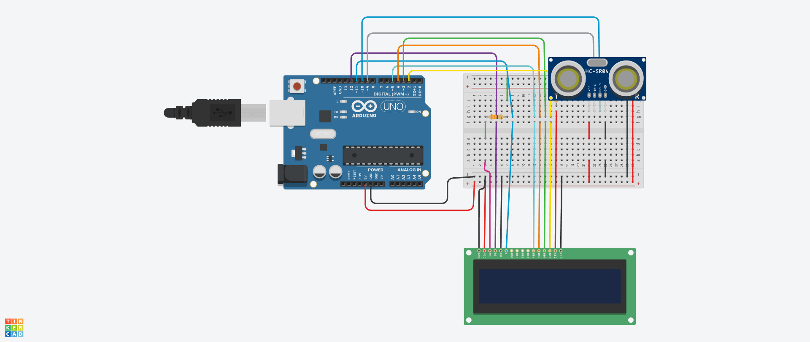

# Sensor Zona Azul
Rafael Perez Carmanhani - 15485420

## Sobre o Projeto
Este projeto é um sistema desenvolvido para a disciplina de eletrônica para computação, utilizando Arduino, que mede o tempo que um veículo fica estacionado. O sistema inicia a contagem quando o veículo é estacionado e calcula a duração total do estacionamento. Utiliza sensores para detectar a presença do veículo e um display para mostrar o tempo decorrido. Este projeto poderia ser utilizado, por exemplo, em vagas com tempo limitado de estacionamento.

## Esquema no Tinkercad:


## Código utilizado

```cpp
#include <LiquidCrystal.h>

const int trigPin = 9;
const int echoPin = 10;

long duration;
int distance;

LiquidCrystal lcd(12, 11, 5, 4, 3, 2);

unsigned long startTime = 0;
unsigned long elapsedTime = 0;

void setup() {
  pinMode(trigPin, OUTPUT);
  pinMode(echoPin, INPUT);
  pinMode(ledPin, OUTPUT);
  
  lcd.begin(16, 2);
  lcd.print("Distancia: ");
}

void loop() {
  digitalWrite(trigPin, LOW);
  delayMicroseconds(2);
  digitalWrite(trigPin, HIGH);
  delayMicroseconds(10);
  digitalWrite(trigPin, LOW);
  
  duration = pulseIn(echoPin, HIGH);
  distance = duration * 0.034 / 2;
  
  lcd.setCursor(0, 1);
  lcd.print(distance);
  lcd.print(" cm    ");
  
  if (distance < 150) { // Se a distância for inferior a 100cm (1 metro)
    if (startTime == 0) { // Se o temporizador não estiver em andamento
      startTime = millis(); // Inicia o temporizador
    }
  } else {
    startTime = 0; // Reinicia o temporizador quando o objeto sai do alcance
  }
  
  if (startTime > 0) { // Se o temporizador estiver em andamento
    elapsedTime = millis() - startTime;
    unsigned long seconds = elapsedTime / 1000;
    unsigned long minutes = seconds / 60;
    seconds = seconds % 60;
    
    lcd.setCursor(0, 0);
    lcd.print("Tempo: ");
    lcd.print(minutes);
    lcd.print("m ");
    lcd.print(seconds);
    lcd.print("s     ");
  }
  
  delay(100);
}
```

## Vídeo do projeto em funcionamento
vídeo

## Componentes utilizados

| Quantidade | Componente          | Valor Individual (R$) | Valor Total (R$) |
|------------|---------------------|-----------------------|------------------|
| 1          | Arduino Uno         | Emprestado            | 0,00             |
| 1          | Sensor Ultrassônico | 16,20                 | 16,20            |
| 1          | Display LCD         | 35,00                 | 35,00            |
| 3          | Resistores          | 0,50                  | 1,00             |
| 1          | Protoboard          | 13,30                 | 13,30            |
| Diversos   | Fios Jumper         | 0,10                  | 1,50             |
|            | **Total**           |                       | **131,00**       |

